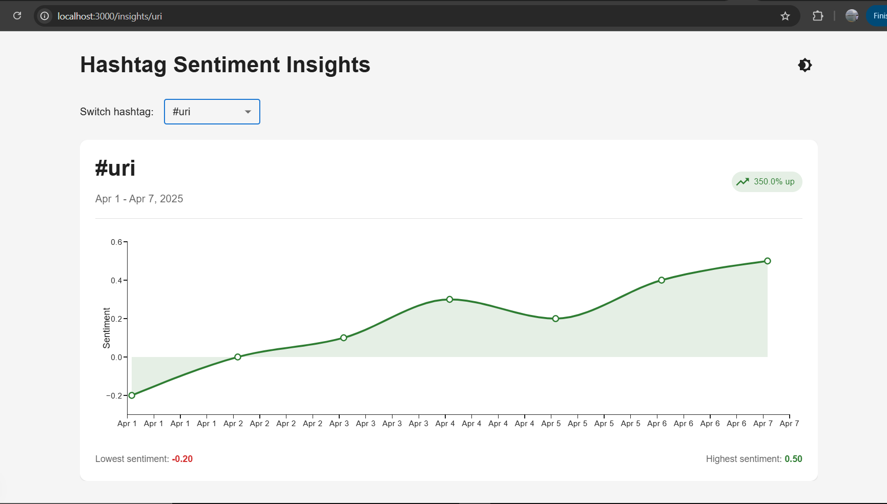
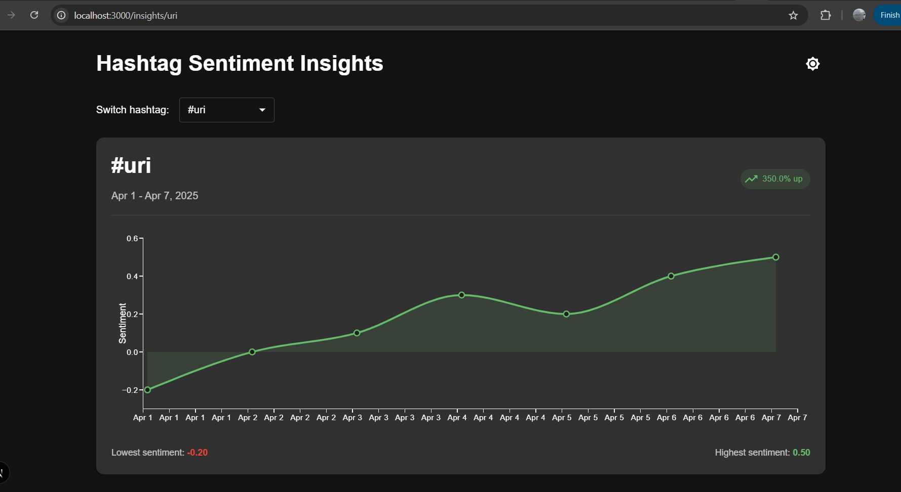

# Hashtag Sentiment Insights

A Next.js application that visualizes sentiment analysis data for hashtags. This project was developed as a frontend engineer assessment.

## Overview of Approach

My approach to this assessment focused on creating a clean, performant, and visually appealing dashboard for hashtag sentiment analysis. I prioritized:

1. **Component Architecture**: Clean separation of concerns with specialized components for chart visualization, trend data display, error handling, and loading states.

2. **Performance Optimization**: Applied memoization techniques using React.memo, useMemo, and useCallback to prevent unnecessary re-renders, especially for the chart component which can be computationally expensive.

3. **User Experience**: Added visual indicators for trend direction, min/max values, and interactive elements to make the data more intuitive and accessible.

4. **Error Handling & Loading States**: Implemented comprehensive error handling with user-friendly error messages and intuitive loading states to provide feedback during data fetching.

5. **Responsiveness**: Ensured the application works well on all device sizes with responsive layouts and optimized visualizations for mobile.

## Screenshots/Demo

## Time Spent

Total time spent on this assessment: **1 hour 25 minutes**

